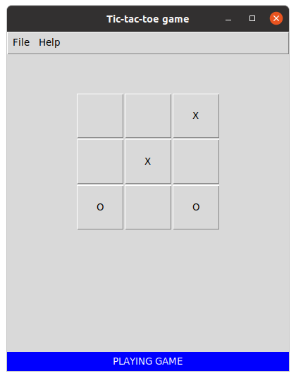

# ttt_ui
tic-tac-toe game with cmd &amp; GUI

# cmd
<code>Command <strong>python3 ttt_cmd.py -h<strong></code>
usage: ttt_cmd.py [-h] [-n] [-r]

Play a game of tic-tac-toe

optional arguments:
  -h, --help            show this help message and exit
  -n, --new             Start new game
  -r, --res, --restore  Restore old game
